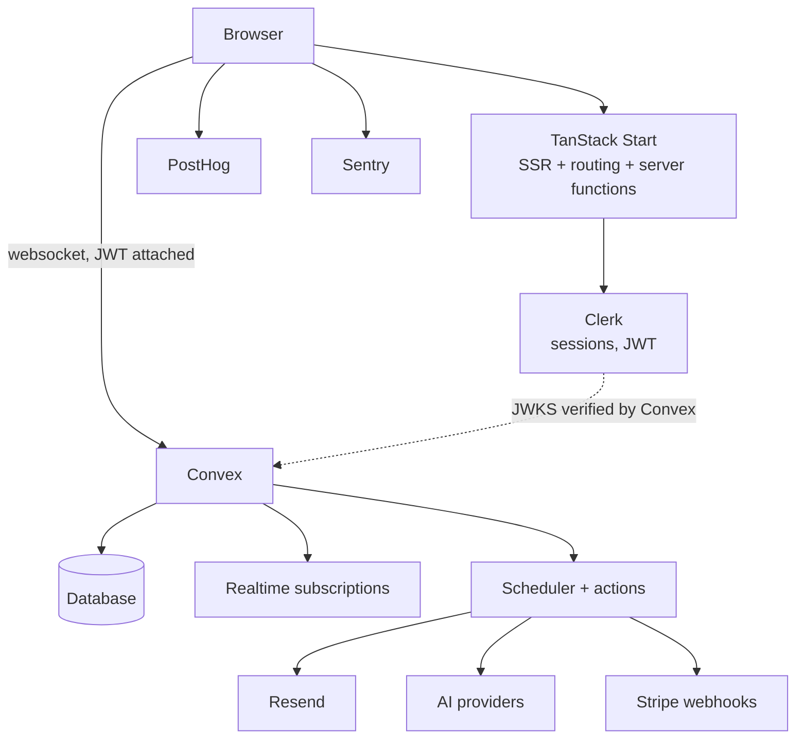

# Architecture

## Shape



The important line is the dotted one. Clerk issues a JWT with `aud: convex`;
Convex fetches Clerk's JWKS and verifies it itself. Convex does not ask the
Start server whether the user is signed in — so a client that bypasses the UI
entirely still faces the same authorization checks.

## Request paths

There are two, and they are different on purpose.

**Data** — browser → Convex, over a websocket, with the Clerk JWT attached by
`ConvexProviderWithClerk`. Queries are live: a mutation in one tab updates
every subscribed tab with no refetch. This is why the app has no client data
cache of its own.

**Documents and routing** — browser → TanStack Start. SSR, head tags, route
guards, and server functions. `fetchAuthState` in `src/lib/auth-guard.ts` is
the only server function so far; it exists so an unauthenticated visitor gets
a redirect instead of a flash of dashboard chrome.

## Authorization

One rule: identity comes from `ctx.auth.getUserIdentity()`, never from an
argument.

`convex/model/auth.ts` provides `requireUser` and `requireOwner`. Every public
function that touches a row goes through them. A row belonging to another user
and a row that does not exist both raise `NOT_FOUND`, so the API cannot be used
to discover which ids are real.

`convex/projects.test.ts` proves it, and the proof is checked: deleting the
ownership comparison makes exactly the cross-tenant tests fail.

Route guards are a separate, weaker thing. `beforeLoad` decides what to render.
It is not a security boundary, and the code says so.

## Multi-tenancy, later

Today: `users` → `projects`, one owner per project. That is the whole model.

Clerk Organizations are available on the free plan, and the JWT already carries
`orgId`/`orgRole` (`ConvexProviderWithClerk` re-issues the token when they
change). The migration when it is needed:

1. add `organizations` and `memberships` tables keyed by the Clerk org id;
2. add `organizationId` to `projects`, backfilled from `ownerId`;
3. replace `requireOwner(user, doc)` with `requireMember(ctx, doc.organizationId)`;
4. keep `ownerId` as the creator, not as the access key.

Steps 3 and 4 are the reason authorization is funnelled through two helpers
rather than inlined in each function. Nothing multi-tenant is built now,
because nothing needs it now.

## Billing (prepared, not installed)

Stripe is deliberately absent from `package.json`: an unused SDK is a
dependency to upgrade for no benefit. Nothing about the current code blocks it.

The intended shape when billing is switched on:

```
Stripe Checkout → Stripe webhook → convex/http.ts httpAction
  → internalMutation writes { stripeCustomerId, subscriptionStatus, plan }
  → app reads entitlements from Convex
```

Rules that matter more than the code:

- **Stripe is the source of financial truth.** Convex caches customer id,
  subscription status, plan and derived entitlements. It never computes money.
- The webhook handler verifies the signature, then delegates to an
  `internalMutation`. Webhook endpoints are public; the mutation is not.
- Webhooks arrive out of order and more than once. Key on the Stripe object id
  and ignore events older than what is stored.
- Entitlement checks live in Convex, next to the authorization checks, for the
  same reason.

Steps: `pnpm add stripe`, add `convex/http.ts`, add the fields to `users` (or a
`subscriptions` table), set `STRIPE_SECRET_KEY` and `STRIPE_WEBHOOK_SECRET` on
the deployment.

## AI

`convex/model/ai.ts` maps `"anthropic:claude-sonnet-4-5"` to a configured AI SDK
model. Providers are Anthropic, OpenAI, Google and OpenRouter; adding one is a
single entry. Keys live on the Convex deployment, so no key ever reaches the
browser, and `resolveModel` throws a message naming the exact missing variable.

AI calls belong in Convex actions: they need secrets, they are slow, and they
usually want scheduling or retries.

There is no abstraction layer over the AI SDK. The AI SDK is already the
abstraction layer.

**Usage accounting, when a feature exists.** `generateText` returns
`usage.inputTokens` / `usage.outputTokens`. Write one row per call into an
`aiUsage` table — `userId`, `feature`, `provider`, `model`, token counts,
estimated cost, `_creationTime` — from the same action that made the call.
Aggregate with `@convex-dev/aggregate` if per-user totals ever need to be fast.
Not built now: there is no AI feature to meter.

**Agents, when they are needed.** `@convex-dev/agent` is the first choice for
persistent threads, tool calls and conversational memory — not a hand-rolled
messages table. The AI SDK stays underneath it.

## Background work

Convex covers it: `ctx.scheduler.runAfter` / `runAt`, cron jobs in
`convex/crons.ts`, and actions for anything that needs the network.

When work becomes genuinely durable — multi-step, resumable, needing retries
and bounded concurrency — the first choice is `@convex-dev/workflow`, not
Inngest, Trigger.dev or Temporal. It runs inside the deployment already paid
for (nothing), keeps state in the same transaction domain, and adds no vendor.

## Rate limiting

Nothing is rate limited today; the app has one user-scoped write path with a
tiny payload.

The plan, when it is needed, is `@convex-dev/rate-limiter` — a Convex
component, so no Redis and no second datastore. It gives token-bucket and
fixed-window limits keyed per user, transactional with the mutation it guards.
Worth applying to: resource creation, AI calls (they cost real money), any
public HTTP action, and sign-in adjacent endpoints.

A hand-rolled counter table is the wrong answer: it races under concurrency
and loses quota when a mutation fails.

## What is deliberately not here

| Not installed | Why | What replaces it |
|---|---|---|
| PostgreSQL, Prisma, Drizzle | Convex is the database, with realtime and a type-safe function layer. A second store would need its own auth, migrations and sync. | Convex tables, indexes and validators |
| Redis | Wanted for cache, rate limiting and pub/sub. Convex queries are already cached and reactive; rate limiting has a component. | Convex + `@convex-dev/rate-limiter` |
| tRPC, GraphQL, Apollo | Convex functions are already end-to-end typed RPC. Adding a second RPC layer over them is pure overhead. | `api.*` from `convex/_generated` |
| TanStack Query | It would cache Convex data a second time, next to Convex's own live cache. | Convex `useQuery`; add Query only for external HTTP APIs |
| Inngest, Trigger.dev, Temporal | Convex has scheduling and durable execution. | `ctx.scheduler`, crons, `@convex-dev/workflow` |
| Pinecone, Qdrant, Weaviate | Convex has native vector indexes and `ctx.vectorSearch`. | Convex vector index |
| Algolia, Meilisearch, Typesense | Convex has full-text search indexes. Reach for an engine at a measured limit, not before. | Convex search index |
| S3, R2, UploadThing | Convex File Storage covers uploads and signed URLs. Revisit for heavy media. | `ctx.storage` |
| Redux, Zustand | Server state is Convex's; the remaining UI state is component-local. | `useState`, URL search params |
| Storybook, Turborepo, Nx | One app, one package. | — |

Each row is a decision that can be revisited with evidence. None of them should
be revisited by default.
